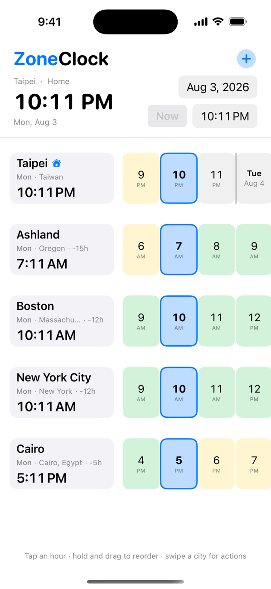
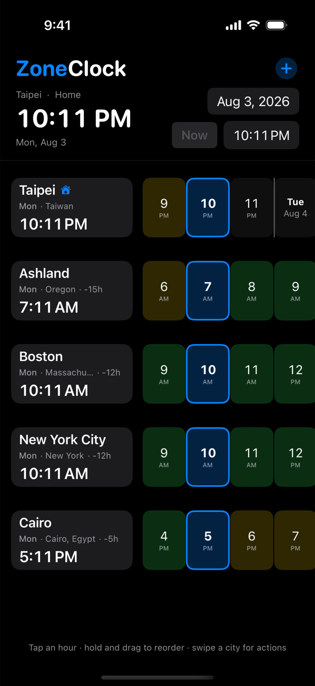

<p align="center">
  
</p>

# ZoneClock

iOS app for comparing times across cities. Pick a time in your home city and
see the local time, weekday, and day offset (+1d / -1d) in every other city
you follow. Works fully offline.

<p align="center">
  
  
</p>

## Features

- See the current time in every city you care about, side by side
- Tap any hour to answer "if it's 10 PM for me, what time is it for them?"
- +1d and -1d badges catch day rollovers before you plan a call for yesterday
- Color-coded hours show who is awake, at work, or asleep
- Add any city, even small towns like Ashland, Oregon; 69k cities searchable
- Plan around any date and time, or snap back to right now
- Works entirely offline

## Layout

- `Sources/App`: SwiftUI app (models, store, views, time math)
- `Resources/cities.tsv`: bundled city database (name, region, country, IANA
  time zone, population), sorted by population descending
- `scripts/build_city_db.py`: regenerates `cities.tsv` from GeoNames dumps
  (`cities5000.txt`, `admin1CodesASCII.txt`, `countryInfo.txt` in `data/`)
- `scripts/make_icon.swift`: renders the app icon
- `Tests`: unit tests for time math and search

## Build

Requires XcodeGen (`brew install xcodegen`); the `.xcodeproj` is generated,
not committed.

```
xcodegen generate
xcodebuild -project ZoneClock.xcodeproj -scheme ZoneClock -destination 'generic/platform=iOS' -allowProvisioningUpdates build
xcodebuild -project ZoneClock.xcodeproj -scheme ZoneClock -destination 'platform=iOS Simulator,name=iPhone 16 Pro' test
```

City data from [GeoNames](https://www.geonames.org/) (CC BY 4.0).
