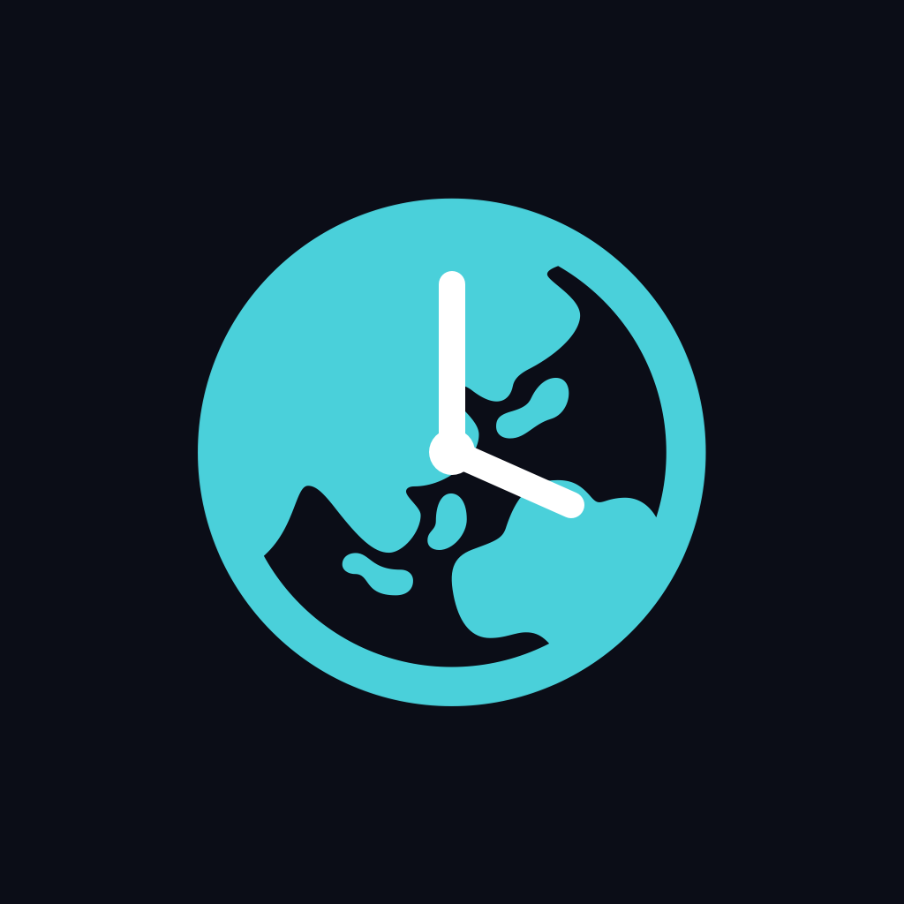

<p align="center">
  
</p>

# ZoneClock

iOS app for comparing times across cities. Pick a time in your home city and
see the local time, weekday, and day offset (+1d / -1d) in every other city
you follow. Works fully offline.

## Features

- Board of saved cities. The top city is home; hold and drag a city to
  reorder the board (and change home). Tap a city to reveal its remove
  button.
- 72-hour grid (yesterday through tomorrow in home time). Each column is one
  absolute instant rendered in each city's local time; tap a cell to select
  that time everywhere. Cells are shaded by local waking hours: green for
  8:00-17:59, yellow for early morning and evening, gray for night.
- Date/time picker and a Now button for exact times and returning to live time.
- Offline city search over a bundled GeoNames extract: 69k cities worldwide
  with population over 5,000, searchable by name plus state/country
  ("ashland or" finds Ashland, Oregon). Results are ranked by population.

## Layout

- `Sources/App`: SwiftUI app (models, store, views, time math)
- `Resources/cities.tsv`: bundled city database (name, region, country, IANA
  time zone, population), sorted by population descending
- `scripts/build_city_db.py`: regenerates `cities.tsv` from GeoNames dumps
  (`cities5000.txt`, `admin1CodesASCII.txt`, `countryInfo.txt` in `data/`)
- `scripts/make_icon.swift`: renders the app icon
- `Tests`: unit tests for time math and search

## Build

Requires XcodeGen (`brew install xcodegen`); the `.xcodeproj` is generated,
not committed.

```
xcodegen generate
xcodebuild -project ZoneClock.xcodeproj -scheme ZoneClock -destination 'generic/platform=iOS' -allowProvisioningUpdates build
xcodebuild -project ZoneClock.xcodeproj -scheme ZoneClock -destination 'platform=iOS Simulator,name=iPhone 16 Pro' test
```

City data from [GeoNames](https://www.geonames.org/) (CC BY 4.0).
